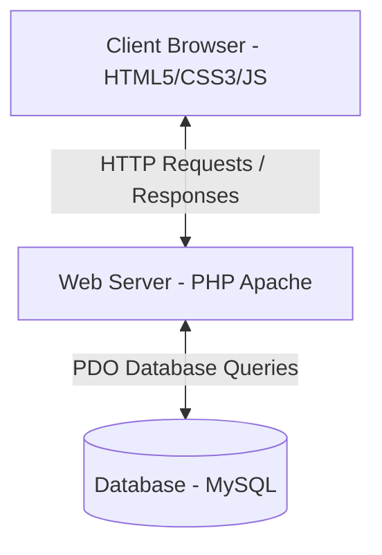
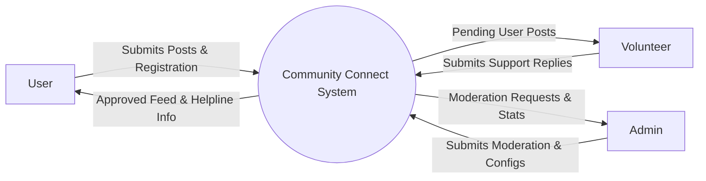
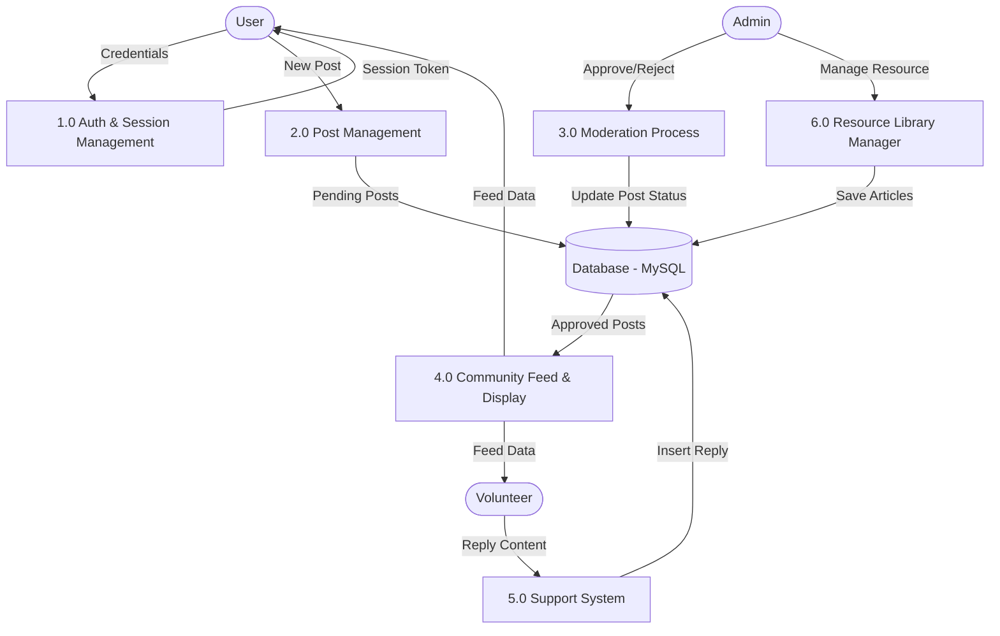
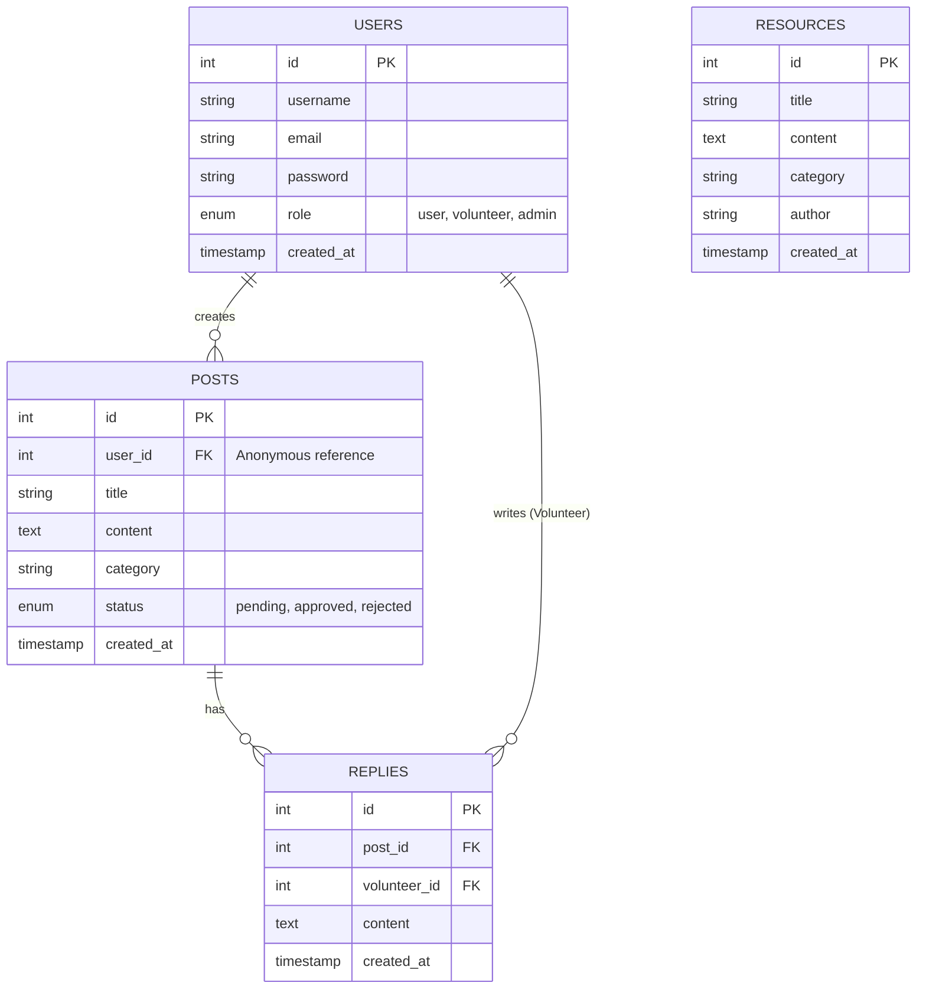

# Community Connect - Documentation
## Anonymous Mental Health Support Platform for NGO Communities

This document contains **Phase 1: Requirement Analysis** and **Phase 2: System Design** for the Community Connect platform.

---

## PHASE 1: Requirement Analysis

### 1. Problem Statement
Mental health issues are on the rise among college students, working professionals, and community members. However, social stigma, fear of judgment, and lack of accessible resources often prevent individuals from seeking help. Existing social media networks do not offer secure anonymity or verified guidance, leading to misinformation or cyberbullying. There is a critical need for a safe, moderated, and completely anonymous platform where individuals can voice their concerns and receive support from verified NGO volunteers.

### 2. Objectives
- **Anonymity First:** Provide a secure platform where users can share their feelings without revealing their identities.
- **Verified Guidance:** Connect users with trained NGO volunteers who can offer professional, empathetic support.
- **Moderated Space:** Implement post-moderation mechanisms managed by Admins to filter out spam, abuse, or offensive content.
- **Resource Integration:** Provide a curated library of mental health resources (articles, self-care guides, breathing exercises).
- **Emergency Preparedness:** Enable immediate access to helplines and crisis contacts.

### 3. Scope
- **Target Audience:** Members of specific communities, college campuses, and NGO circles.
- **Exclusions:** This platform is *not* a replacement for formal psychiatric diagnosis or intensive medical therapy. It acts as a supportive peer-to-peer and community-to-NGO buffer.

### 4. Functional Requirements

#### User Module
- **Registration & Login:** Secure registration with email validation; system stores credentials securely.
- **Anonymous Post Creation:** Write and submit posts detailing concerns. Users can select categories (e.g., Anxiety, Stress, Academic Pressure).
- **Manage Posts:** View, edit, or delete own posts.
- **Community Feed:** Browse posts approved by administrators and see responses from volunteers.

#### Volunteer Module
- **Dashboard:** Access list of user posts requiring attention.
- **Response System:** Post replies/support messages directly to user posts.
- **Resolution Tracking:** Option to mark a post thread as "Resolved/Supported."

#### Admin Module
- **User Management:** Manage, block, or delete users/volunteers.
- **Post Moderation:** Review pending posts and either "Approve" (publishing them to the Community Feed) or "Reject" (deleting/hiding them).
- **Resource Management:** Add, edit, or delete articles and guides in the Resource Library.
- **Dashboard Stats:** High-level summary of active users, pending reviews, and resolved threads.

### 5. Non-Functional Requirements
- **Security:** Hashed passwords (using bcrypt), sanitized inputs to prevent SQL Injection (SQLi) and Cross-Site Scripting (XSS).
- **Anonymity Protection:** Usernames/emails of authors are hidden on the frontend for all community feed posts.
- **Usability:** Responsive layout built with clean CSS, accessible via mobile and desktop.
- **Availability:** Fast response times using lightweight PHP pages.

---

## PHASE 2: System Design

### 1. Architecture Diagram
The application follows a classic **3-Tier Client-Server Architecture**:



- **Presentation Layer (Frontend):** Responsive HTML, CSS with modern styling, and vanilla JavaScript.
- **Application Layer (Backend):** PHP engine processing requests, managing sessions, and validating input.
- **Data Layer (Database):** MySQL relational database storing user records, posts, replies, and resources.

### 2. Use Case Diagram
Describes the interactions between the primary actors (User, Volunteer, Admin) and system use cases.

```mermaid
left_to_right_direction
actor User
actor Volunteer
actor Admin

rectangle System {
    User --> (Register / Login)
    User --> (Create Anonymous Post)
    User --> (Manage Own Posts)
    User --> (View Feed & Resources)
    User --> (Access Emergency Helplines)

    Volunteer --> (Login)
    Volunteer --> (View Feed & User Posts)
    Volunteer --> (Reply to Posts)
    Volunteer --> (Mark Thread Resolved)

    Admin --> (Login)
    Admin --> (Moderate Posts Approve/Reject)
    Admin --> (Manage Users & Volunteers)
    Admin --> (Manage Resource Library)
    Admin --> (View System Stats)
}
```

### 3. Data Flow Diagram (DFD)

#### Level 0: Context Diagram
Shows the high-level boundary of the system.



#### Level 1: Detailed DFD
Details the internal processes of the system.



### 4. Entity-Relationship (ER) Diagram
Shows the logical database structure, entity sets, and their relationships.



### 5. Database Schema Details

#### Table: `users`
| Column Name | Data Type | Key/Constraints | Description |
| :--- | :--- | :--- | :--- |
| `id` | INT | Primary Key, AUTO_INCREMENT | Unique identifier for each account |
| `username` | VARCHAR(50) | UNIQUE, NOT NULL | Registration username (hidden in anonymous feeds) |
| `email` | VARCHAR(100) | UNIQUE, NOT NULL | Email address for account verification |
| `password` | VARCHAR(255) | NOT NULL | Hashed password password_hash() |
| `role` | ENUM('user','volunteer','admin') | NOT NULL, DEFAULT 'user' | Access control level |
| `created_at` | TIMESTAMP | DEFAULT CURRENT_TIMESTAMP | Date and time of registration |

#### Table: `posts`
| Column Name | Data Type | Key/Constraints | Description |
| :--- | :--- | :--- | :--- |
| `id` | INT | Primary Key, AUTO_INCREMENT | Unique identifier for the post |
| `user_id` | INT | Foreign Key -> `users(id)`, ON DELETE CASCADE | Author reference (never displayed on feed) |
| `title` | VARCHAR(150) | NOT NULL | Title summarizing the post issue |
| `content` | TEXT | NOT NULL | Detailed post text |
| `category` | VARCHAR(50) | NOT NULL | E.g. Academic, Stress, Anxiety, Relationships |
| `status` | ENUM('pending','approved','rejected') | NOT NULL, DEFAULT 'pending' | Admin moderation state |
| `created_at` | TIMESTAMP | DEFAULT CURRENT_TIMESTAMP | Time of submission |

#### Table: `replies`
| Column Name | Data Type | Key/Constraints | Description |
| :--- | :--- | :--- | :--- |
| `id` | INT | Primary Key, AUTO_INCREMENT | Unique identifier for reply |
| `post_id` | INT | Foreign Key -> `posts(id)`, ON DELETE CASCADE | Associated post |
| `volunteer_id` | INT | Foreign Key -> `users(id)`, ON DELETE CASCADE | Volunteer answering the post |
| `content` | TEXT | NOT NULL | Answer description |
| `created_at` | TIMESTAMP | DEFAULT CURRENT_TIMESTAMP | Reply creation time |

#### Table: `resources`
| Column Name | Data Type | Key/Constraints | Description |
| :--- | :--- | :--- | :--- |
| `id` | INT | Primary Key, AUTO_INCREMENT | Unique resource ID |
| `title` | VARCHAR(150) | NOT NULL | Article title |
| `content` | TEXT | NOT NULL | Article body |
| `category` | VARCHAR(50) | NOT NULL | Category classification |
| `author` | VARCHAR(100) | NOT NULL | Publisher name |
| `created_at` | TIMESTAMP | DEFAULT CURRENT_TIMESTAMP | Creation time |
